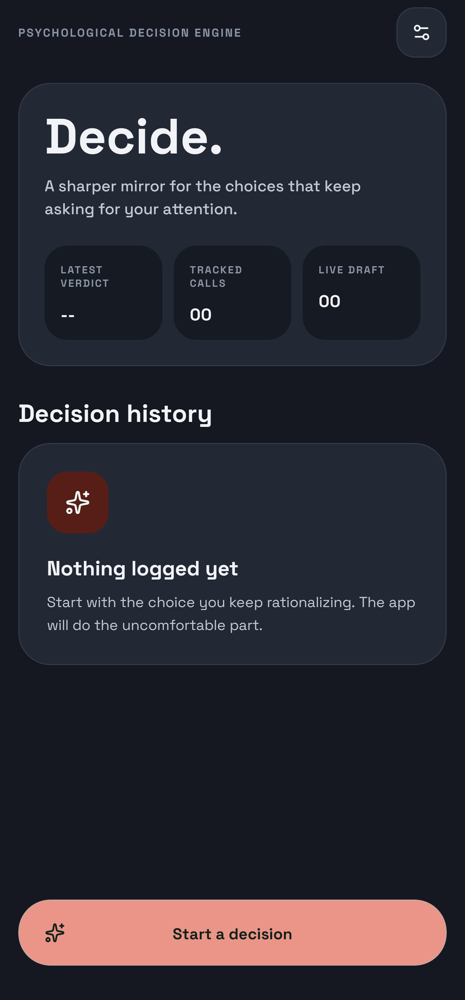
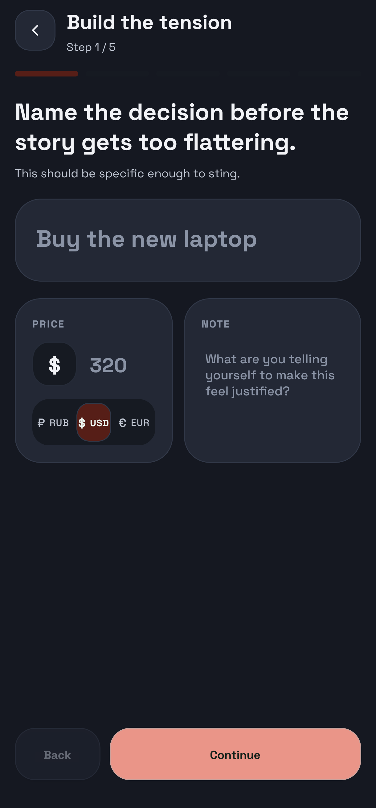
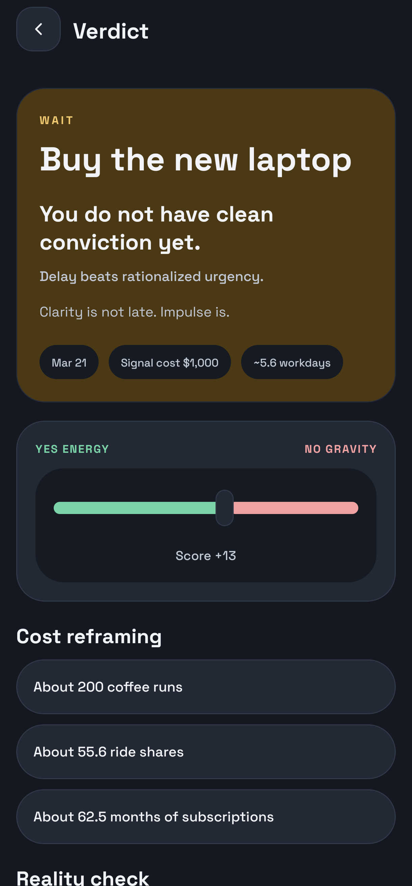

<div align="center">
  

  <h1>Decide</h1>
  <p><i>Think before you act.</i></p>

  <p align="center">
    
    
    
    
  </p>
</div>

---

## What it is

Decide is a local-first mobile app for slowing down and making better decisions.

Not a to-do list.  
Not a productivity tool.

It helps you:

- define a decision clearly
- weigh pros and cons
- tag emotional bias
- run reality checks
- review the outcome
- come back later and see what actually happened

The goal is simple: create enough friction to stop impulsive choices and enough clarity to make honest ones.

## Why it matters

Most bad decisions do not feel bad at the moment.

They feel justified, urgent, emotional, or convenient.

Decide is built to close that gap by making tradeoffs visible before you act, then turning past choices into feedback instead of vague memory.

## Core flow

Each decision moves through a deliberate multi-step flow:

1. Title
2. Pros
3. Cons
4. Weights
5. Review

After that, the app keeps the decision in history so you can reflect on whether the result actually matched your expectations.

## Key features

- Weighted pros and cons
- Emotional bias tags
- Reality checks for impulse, cost, pressure, and context
- Cost reframing for money decisions
- Outcome tracking
- Decision history and pattern memory
- Fully offline storage on device

## Experience

- Clean multi-step flow with motion and low visual noise
- English and Russian localization with instant switching
- Dark, light, and system theme modes
- Material You accent support on Android 12+
- Dynamic Android app icon support

## Screenshots

<p align="center">
  
  
  
</p>

## Tech stack

- React Native
- Expo
- Expo Router
- TypeScript
- Zustand
- React Native Reanimated
- AsyncStorage
- i18next

## Project structure

```text
app/
components/
lib/
locales/
store/
theme/
android/
assets/
```

## Run locally

### Requirements

- Node 20.19+ or Node 22 LTS
- JDK 17 for Android builds
- Android SDK / platform-tools

### Install

```bash
npm install
```

### Start Expo

```bash
npx expo start
```

### Run on Android

```bash
npx expo run:android --device
```

## Notes

- The app is local-first and does not require a backend.
- Language and theme preferences are stored locally.
- Some Android-specific features, such as themed icons and Material You accents, depend on launcher and OS support.
- Native Android files are committed because the project includes platform-specific behavior.

## License

GPL-3.0. See [LICENSE](./LICENSE).
